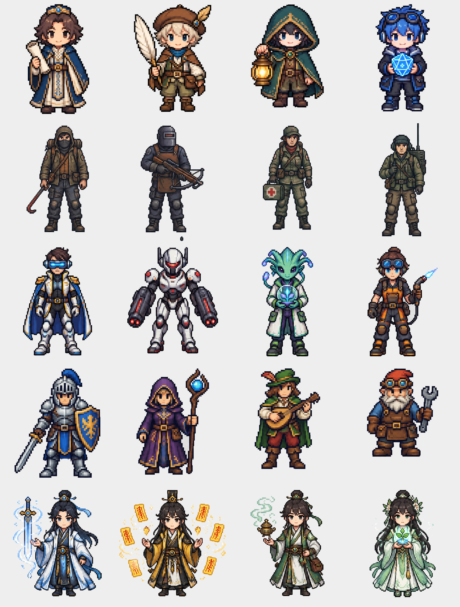
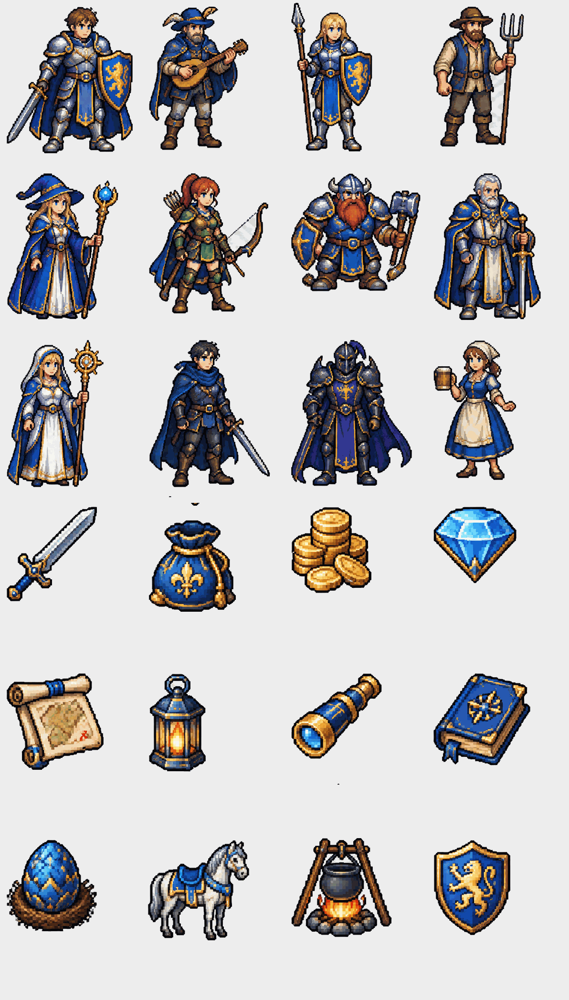
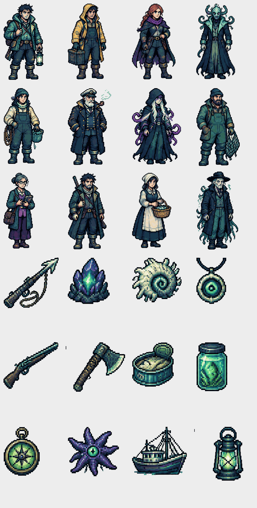
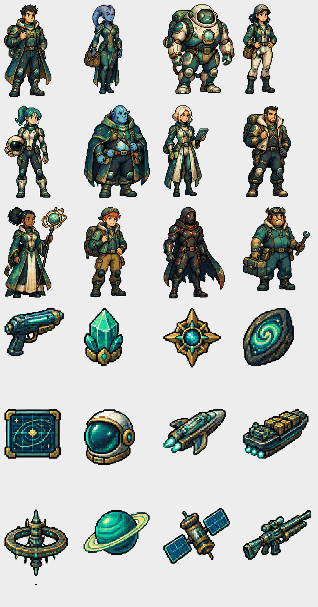

[English](README.en.md) | 中文

# WorldSim · 多Agent世界模拟器 → 网文生产引擎

[](https://github.com/2033121/worldsim/actions/workflows/ci.yml)
[](https://github.com/2033121/worldsim/blob/main/LICENSE)
[](https://go.dev/)
[](#)
[](https://github.com/2033121/worldsim/releases)
[](https://github.com/2033121/worldsim/stargazers)

> 让 AI 模拟"一个世界真实地运转"，再把世界编年史自动改写成人味十足的小说。

> 基于 [Nigh/show-me-the-story](https://github.com/Nigh/show-me-the-story) 深度改造（Go 单二进制 + WebUI，零外部依赖）。
<p align="center"></p>

## ✨ 特性

- **多Agent世界模拟**：总导演(GM)/事件Agent/主角三问决策/感知分发/NPC互动/小说写手，各司其职
- **文字游戏游玩模式（Play Mode）**：一手开世界，一手当玩家——自由输入（行动/说话/叙事三模式），**命运在骰子上**：代码层掷骰（d20+属性修正 vs 难度）+ 代码持有数值层（HP/等级/经验/背包/任务，`game.json` 落盘），LLM 只有两件事——把你的输入裁决成意图与难度、把既定结果讲成第二人称叙事；「等待」回合世界自转+休息回血；回合数值同步回引擎实体，游戏产物可反向喂小说播种；开局时后台模拟自动暂停，回合制不空转烧 token
- **任意题材通用**：15个主题包（修仙/末世/西幻/克苏鲁/都市/星际/历史…）+ 通用世界书骨架 → 一句话创建新世界
- **游玩页世界观感（v1.9.0）**：把美术工坊的素材真正长进游玩界面——晨/暮/夜场景横幅随世界时钟轮转、在场角色像素头像+好感度徽标（裁判申报、代码收数）、背包物品图标网格、**确定性地图视图**（地点→snake 网格+tile 语义渲染，LLM 不参与布局，逐格可复现）；世界书新增 `W1 动态条目`：`- 关键词 => 情报` 中文子串匹配+sticky 3 回合+1200 字预算，最近剧情提到就自动注入裁判/叙述者并在游玩页显示命中的情报 chips（借鉴 SillyTavern World Info 而为中文重造）；**世界卡** `GET /api/world/card` 一键打包你的世界书+美术+规划成 zip 分享，他人 `POST /api/worlds/import` 落地即玩——控制台「🃏 世界卡」标签有导出/导入入口
- **游玩手感（v1.10.0）**：**↩ 撤销上一步**（单步回滚数值/背包/好感/位置——后悔药在代码层，重启也能撤）；**倒下状态机**（HP 触底出红色警示横幅，等待回血恢复意识）；**💾 存档 / 📥 读档**（`GET /api/game/export` / `POST /api/game/import`，越界值自动收数）；d20 检定滚动动画、HP 条变色、输入历史 ↑/↓；等待回合会把世界时钟推进一天（场景横幅随游玩轮转）
- **美术工坊（v1.8.0 内建图片生成）**：每个世界自己的像素美术——打开 `/studio` 配好图片服务，AI 先读你的世界书产出**素材规划**（12 人物 / 8 怪物 / 晨暮夜 3 场景 / 16 地图块 / 24 物品，每条带中文速写+英文提示词+世界专属调色板，可编辑），然后一键批量生成 sheet → **进程内自动裁剪抠底**成透明 sprite（空格自动单品补齐），产物直接接入游玩页自动换装；规划与每次生成全留痕（`art/plan.json` + `art/history.json`），单个人物不满意行内"重生成/重掷"；生成器可插拔（OpenAI images 中转站 / PixelLab 像素专用 API）
- **时间尺度自适应**：修仙跳年、末世跳日、星际按标准时——LLM 从世界书自行判断，不硬编码
- **就绪度驱动**：模拟不按天数结束，按"素材够不够写小说"（段落/戏剧素材/伏笔回收/张力）自动判定
- **岔口决策队列**：剧情多方向岔口 AI 自动代决（零阻塞），用户可随时翻案，写手按用户方向写
- **时间回退**：快照制存档，剧情跑偏/卡死随时回退到任意锚点重新演化
- **去AI味**：886+ 条真实网文示范素材库 + 六层写作方法论注入（记忆钉/冲突钩子/伏笔/感官五维/视角三不/高频词禁用）
- **双控制入口**：WebUI 可视化控制台（浏览器操作）+ 沙盒包 API（AI 对话驱动）
- **统一前端入口**：浏览器式导航外壳（多标签/地址栏/前进后退/书签/命令面板 Ctrl+K/明暗主题），一键切换小说创作/世界模拟/文字游戏三种玩法（:48092 网关：ugeg 外壳 + `/api/novel/*`→48090、其余 `/api/*` 与 `/game`→48091）
- **题材研究智能体**：联网搜索热门题材 + 读取附件 → 产出 2-3 个候选对比方案 / 世界书方向 / 题材卡片，再引导建世界
- **联网搜索 & 写作搜素材**：内置 Tavily 搜索后端（可切 SearXNG / Bing / BingHTML），写作页直接搜素材一键复制，搜索结果 + 世界参考资料注入 LLM 上下文
- **世界直接播种小说**：把已模拟世界的世界书/角色/势力/近期编年史事件直接播种成小说大纲与设定，零 LLM 调用
- **LLM 用量看板**：全局 token 统计（实时聚合 + 小时/天时间窗持久化历史 + 费用估算），TokenStats 页面可视化
- **单二进制**：Go embed WebUI，零外部依赖，ARM64/Android 直接跑

## 🏗️ 架构

```
WorldSim
├── 统一前端入口 :48092（浏览器式导航外壳 + API 网关，推荐访问）
│   ├── 小说创作应用（代理到 48090）
│   └── 世界模拟控制台（代理到 48091）
├── 小说创作服务 :48090（show-me-the-story 流水线）
├── 世界模拟服务 :48091
│   ├── State Engine（事件溯源：event_log.jsonl + world_state.json + Replay）
│   ├── Simulator（多Agent调度：事件→感知→主角决策→GM裁决→NPC→记录）
│   │   ├── GM Agent        世界书裁决/段落规划（导演）
│   │   ├── Event Agent     事件生成（B5事件谱：冲突/奇遇/生活切片…）
│   │   ├── Protagonist     三问决策（价值/能力/世界线）→ 记忆沉淀
│   │   ├── NPC 互动        Init→Act→React 对话链
│   │   └── 伏笔账本        埋设/成熟/回收全周期
│   ├── 世界书体系          _template.md 通用骨架 + themes/ 15主题包 + B5事件谱
│   ├── 就绪度             arcs/drama/foreshadows/tension 四指标
│   ├── 时间回退            snapshots/ 快照目录（文件复制制）
│   ├── 题材研究 Agent     联网搜索 → 候选对比 / 世界书方向 / 题材卡片
│   ├── 联网搜索            内置 Tavily（可切 SearXNG/Bing），写作页搜素材
│   ├── 世界→小说播种        WorldData 直接播种大纲/角色/世界观，零 LLM 调用
│   └── LLM 用量统计        实时聚合 + hour/day 时间窗持久化 + 费用估算
└── WebUI              统一前端（Tab 切换小说/世界控制台，含 TokenStats 页）
```

## 🚀 快速开始

### 1. 构建（Go 1.22+）

```bash
go build -o worldsim .
# 产物：单个 ~10MB 二进制，零依赖
```

### 2. 配置 LLM（api.json，放在程序目录）

```json
{
  "base_url": "https://your-api-endpoint/v1",
  "model": "your-model",
  "api_key": "YOUR_API_KEY",
  "http_timeout_seconds": 300,
  "model_tiers": {
    "fast": "your-fast-model",
    "normal": "your-normal-model",
    "premium": "your-premium-model"
  }
}
```

### 3. 启动

```bash
./worldsim /path/to/data-dir
# 统一前端入口: http://localhost:48092（推荐，浏览器式导航）
# 世界模拟服务: http://localhost:48091
# 小说创作服务:  http://localhost:48090
```

浏览器打开 `http://localhost:48092` 即浏览器式导航外壳：首页点击进入小说创作或世界模拟控制台，建世界（选主题包或研究引导）→ 初始化 → 开循环 → 等就绪 → 生成小说。

### 4. 用 API 驱动（一行跑通）

```bash
# 创建世界（主题包+一句话设定 → LLM 自动生成世界书）
curl -X POST localhost:48091/api/worlds/create \
  -H 'Content-Type: application/json' \
  -d '{"name":"青岚界","theme":"经典修仙","desc":"山村少年捡到残破剑胚"}'

# 初始化（按世界书生成主角/NPC/地点）
curl -X POST localhost:48091/api/world/init

# 后台持续运行（到就绪自动停）
curl -X POST localhost:48091/api/world/loop \
  -H 'Content-Type: application/json' -d '{"action":"start","days":1000}'

# 查就绪 → 生成小说 → 读章节
curl localhost:48091/api/world/readiness
curl -X POST localhost:48091/api/world/novel/generate
curl localhost:48091/api/world/novel/chapter/1

# —— 换个玩法：把同一个世界直接玩起来（文字游戏模式）——
# 开局（自动暂停模拟循环；LLM 生成主题适配的属性表/开场）
curl -X POST localhost:48091/api/game/start
# 行动一回合（do|say|story 三模式；代码掷骰，LLM 叙述结果）
curl -X POST localhost:48091/api/game/action \
  -H 'Content-Type: application/json' \
  -d '{"input":"检查剑胚是否可用","mode":"do"}'
# 等待一回合（世界自转+休息回血+世界时钟推进一天）；浏览器直开 http://localhost:48091/game 有终端风游戏页
curl -X POST localhost:48091/api/game/wait
# 后悔药：撤销上一步（数值/背包/好感回滚到该回合前）；存档带走/回灌
curl -X POST localhost:48091/api/game/undo
curl -o save.json localhost:48091/api/game/export
curl -X POST localhost:48091/api/game/import -H 'Content-Type: application/json' --data-binary @save.json
```

## 📚 API 一览

| 分组 | 接口 |
|---|---|
| 世界管理 | `GET /api/worlds` `POST /api/worlds/create` `POST /api/worlds/select` `POST /api/world/init` |
| 状态 | `GET /api/world/state` `GET /api/world/chronicle` `GET /api/world/memories` `GET /api/world/foreshadows` |
| 模拟 | `POST /api/world/sim/day` `POST /api/world/loop`(start/stop/status) `GET /api/world/readiness` |
| 决策 | `GET /api/world/decisions` `POST /api/world/decisions/{id}` |
| 时间回退 | `GET /api/world/snapshots` `POST /api/world/snapshot` `POST /api/world/rewind` |
| 小说 | `POST /api/world/novel/generate` `GET /api/world/novel` `GET /api/world/novel/chapter/{num}` |
| 文字游戏 | `GET /api/game/status` `POST /api/game/start` `POST /api/game/action` `POST /api/game/wait` `POST /api/game/undo` `GET /api/game/export` `POST /api/game/import` `POST /api/game/stop` `GET /api/game/log`（UI：`GET /game`；世界卡：`GET /api/world/card` / `POST /api/worlds/import`） |
| 主题包 | `GET /api/worldbooks/themes` |
| 统计 | `GET /api/world/token_stats` `GET /api/world/sim/thinking` |

## 🤖 AI 客户端接入（MCP）

WorldSim 提供标准 MCP Server（`worldsim-mcp/server.py`，零依赖），可接入 Codex CLI / Trae / Claude / Cursor：

- Codex：`worldsim-mcp/codex.md`（config.toml / .mcp.json / codex mcp add）
- Trae：`worldsim-mcp/trae.md`（MCP 面板 stdio 添加）
- 仓库根 `AGENTS.md` 是 Codex 的协作指南

## 🎨 包装图

| 游玩模式 Play Mode | 一个引擎，任意题材 | 多智能体徽章 |
|---|---|---|
|  |  |  |

**MCP + AI 客户端接入**（Codex/Trae/Claude 通过 30 个 `world_*` 工具直接驱动）：


**时间回退**（快照制锚点，剧情跑偏随时重演分支）：


### 主题包封面（15 个主题包中的代表 5 款）

| 经典修仙 | 末世废土 | 西幻奇幻 | 克苏鲁异界 | 星际科幻 |
|---|---|---|---|---|
|  |  |  |  |  |

_均由 gpt-image-2 按本仓库主题生成（水墨卷轴风，图内零文字零水印）；生成脚本见 `scripts/gen_art.py` 与 `scripts/gen_art_extra.py`。_

### 像素角色包（20 人，透明底可直接当素材用）



### 像素套件（五大主题 × 63 资产：人物 12 / 怪物 8 / 三时段场景 / 16 map tile / 24 物品）

| 经典修仙 | 末世废土 | 西幻奇幻 | 克苏鲁异界 | 星际科幻 |
|---|---|---|---|---|
|  |  |  |  |  |

**每个世界还可以有自己的美术**：v1.8.0「美术工坊」（`GET /studio` + `internal/art`）让 AI 按你的世界书产出素材规划并生成专属像素套件，游玩页优先使用本世界素材（`/art/{file}.png`），无规划时回落下方打包套件。

**游玩页已自动接线**：`/api/game/status` 依据世界书题材返回 `theme` + 主题匹配的 sprite 列表，游玩页按世界主题自动换装（人物立绘/检定失败出怪物图），资产经 `GET /pixel-art/{theme}/{file}.png` 直出（磁盘 `docs/art/pixel/` 优先，量化压缩后全库仅 ~22MB）。sheet 生成 `scripts/gen_pixel_suite.py` + manifest 裁剪 `scripts/crop_grid.py`（4x3 人物 / 4x2 怪物 / 三联场景 / 4x4 tile 整格 / 6x4 物品）。


## 📥 下载

多平台二进制 + 插件包 + MCP Server 全部见 [Releases](https://github.com/2033121/worldsim/releases)（最新 **v1.4.0**）：

- Linux amd64 / arm64（tar.gz）
- Windows amd64（zip，含 run.bat 一键启动）
- macOS amd64 / arm64（tar.gz）
- `worldsim_plugin_v1.4.0.zip`（Operit 插件包，直接导入）
- `worldsim-mcp-v1.4.0.zip`（Codex/Trae/Claude MCP Server，零依赖）

> 🔄 **发布全自动**：打 `v*` tag 即触发 GitHub Actions 交叉编译 5 平台 + 自动组装插件包/MCP 包，共 7 个资产，无需手动上传。

### ✨ v1.4.0 更新亮点

- **联网搜索（内置 Tavily）**：写作页「搜素材」面板一键搜索网络素材，无需再自托管 SearXNG 容器
- **世界 → 小说直接播种**：把世界书 / 角色 / 势力 / 近期编年史事件直接播种成小说大纲与设定（零 LLM 调用）
- **LLM 用量统计（TokenStats）**：全局 token 实时聚合 + hour/day 持久化 + 费用估算
- **技能注入写作 / 大纲**：大纲 / 分卷 / 章节生成自动注入已启用技能 SOP
- **MCP / Operit 升级到 26 个工具**：新增 `world_seed_novel`（世界播种小说），Codex / Trae / Operit 均可调用

## 🔌 Operit 插件包

本仓库是核心源码。打包好的 **Operit 插件包**（沙盒包 26 工具 + Skill + WebUI 控制台 + 15 主题包 + 886 条风格素材 + 验收清单）以 zip 形式随 Release 分发（CI 自动组装），可直接导入 Operit 使用。

## 📂 目录说明

```
worldsim/
├── main.go            服务入口（三端口：48092统一 / 48091世界模拟 / 48090小说）
├── worldapp/          统一前端源码（Svelte+Vite+Tailwind+DaisyUI，浏览器式导航外壳）
├── worldweb/          世界模拟控制台前端源码
├── frontend/          小说创作前端源码
├── uiteg/             统一前端构建产物（embed）
├── wsweb/             世界控制台构建产物（embed）
├── static/            小说前端构建产物（embed）
├── internal/
│   ├── engine/        State Engine（事件溯源/提案/重放/软规则）
│   ├── sim/           多Agent模拟器（事件/决策/NPC/伏笔/记忆/快照/就绪度）
│   ├── worldbook/     世界书解析 + 主题包 + LLM世界书生成
│   ├── research/      题材研究智能体（热门题材/世界书方向/题材卡片）
│   ├── attach/        世界参考资料附件管理
│   ├── search/        SearXNG 联网搜索后端
│   ├── llm/           分层模型调用 + token 追踪 + 前缀缓存统计 + 工具调用
│   ├── novel/         小说写手（素材投喂/章节规划/去AI味铁律）
│   └── config/        配置加载
├── worldbooks/        世界书池（模板+主题包+实例）
└── docs/              设计文档
```

## ⚠️ 安全与版权

- **密钥**：`api.json` 已被 `.gitignore` 排除，**绝不提交**。示例请用占位符。
- **数据**：`worlds/` `storys/` 为个人世界数据，不入库。
- **素材库**：`material/`（886+ 条真实网文风格示范，每条标注来源书名+章节，仅风格参考）已开源入库。

## 📜 License

[MIT](LICENSE)
